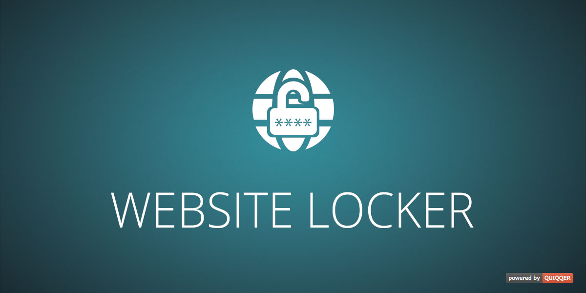

Website Locker
========

This module allows you to block frontend access to your project behind password protection. 
Among other things, you can use it to block crawlers from search engines.

Package name:

    quiqqer/website-locker

Features
--------

- Choose between backgrounds

Installation
------------

The package name: quiqqer/website-locker

Contribution
----------

- Issue Tracker: https://dev.quiqqer.com/quiqqer/website-locker/issues
- Source Code: https://dev.quiqqer.com/quiqqer/website-locker/tree/master 

Support
-------

If you found any flaws, have any wishes or suggestions you can send an email
to [support@pcsg.de](mailto:support@pcsg.de) to inform us about your concerns. 
We will try to respond to your request and forward it to the responsible developer.

Licence
-------

MIT
